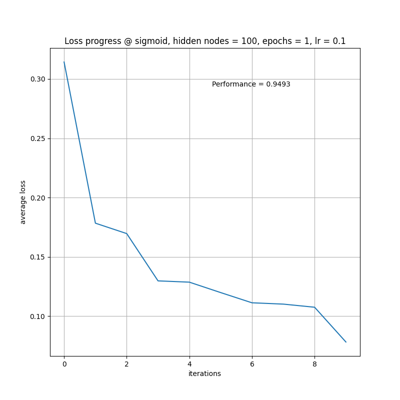
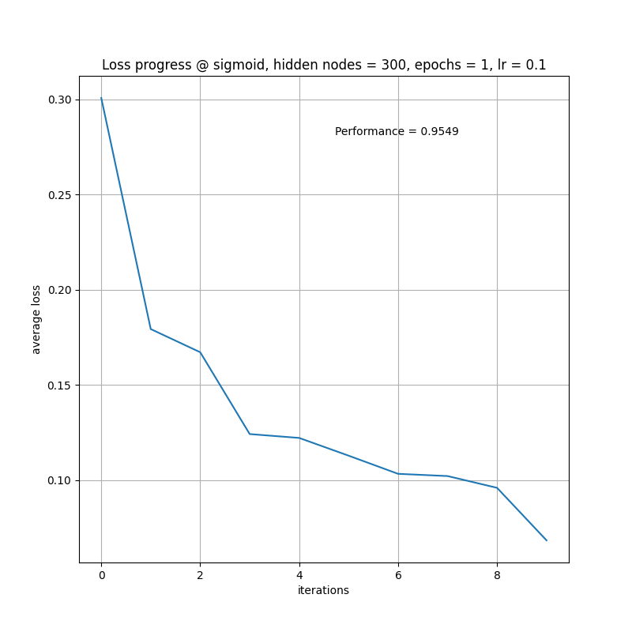
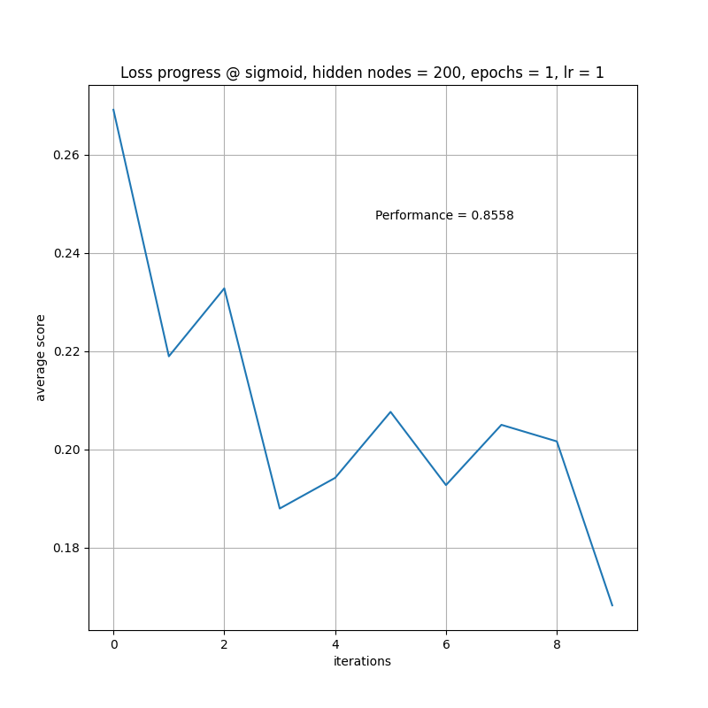
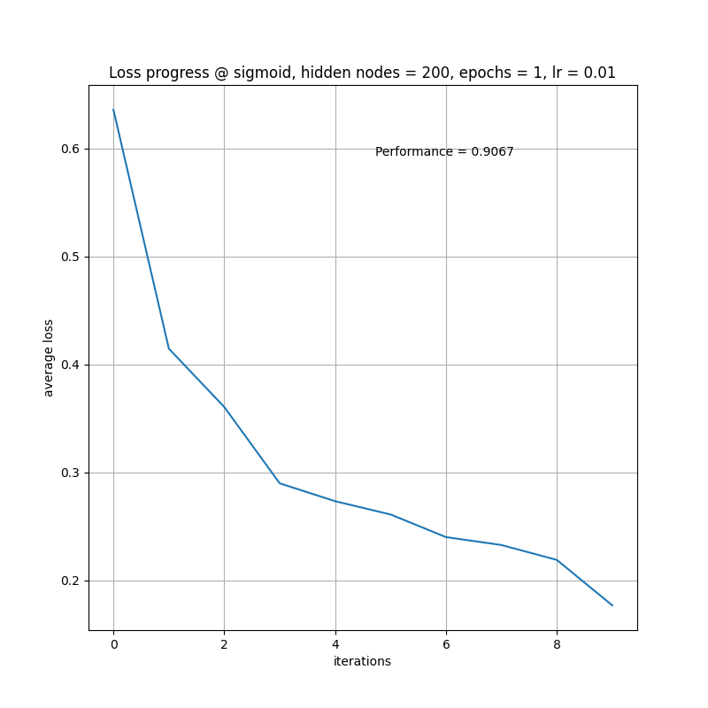
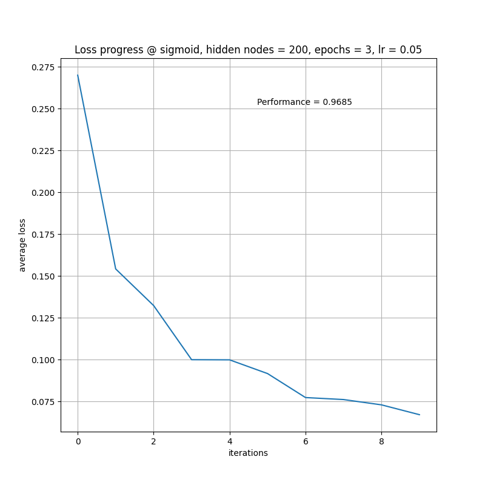
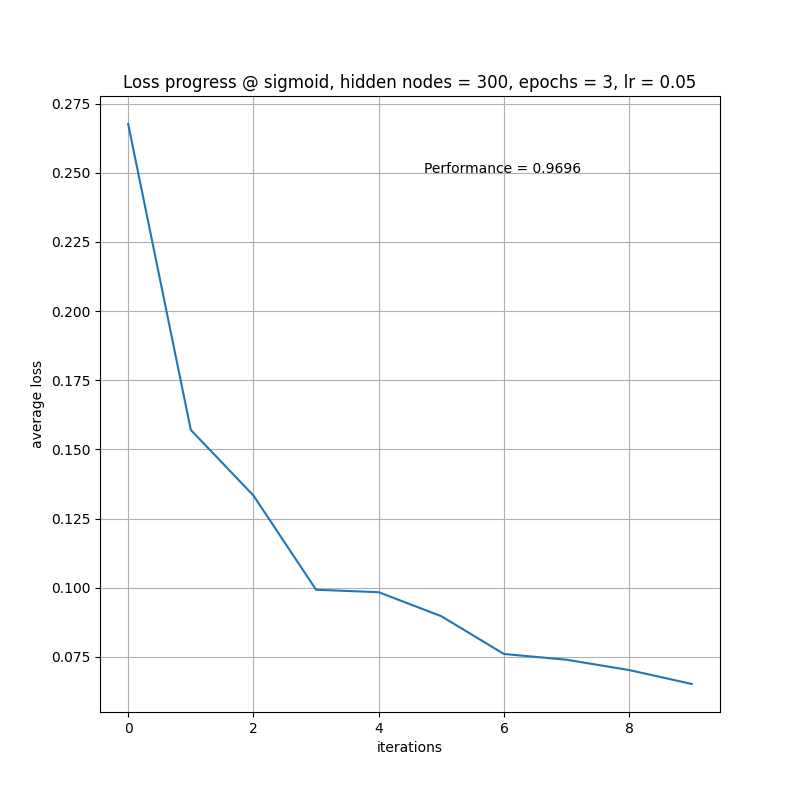

##  MNIST perceptron

We have perceptron designed to recorgnize hand-written digits. Changing hyperparameters - number of neurons in hidden
layer, number of epochs, learning rate - we may impact accuracy of recognition which we test on a test sample. As an
activation function Sigmoid is used. Accuracy score is calculated after testing on a test sample as number of
 successfull recognitions divided by the test sample size.

The results of changing hyperparameters are summarized in the table below:
<table>
  <tr>
    <th>Activation func</th>
    <th>Hidden layer size</th>
    <th>Number of epochs</th>
    <th>Learning rate</th>
    <th>Score</th>
    <th>Figure</th>
  </tr>
  <tr>
    <td>sigmoid</td>
    <td>200</td>
    <td>1</td>
    <td>0.1</td>
    <td>0.9548</td>
    <td>Fig.1</td>

  </tr>
  <tr>
    <td>sigmoid</td>
    <td>100</td>
    <td>1</td>
    <td>0.1</td>
    <td>0.9493</td>
    <td>Fig.2</td>
  </tr>
  <tr>
    <td>sigmoid</td>
    <td>300</td>
    <td>1</td>
    <td>0.1</td>
    <td>0.9549</td>
    <td>Fig.3</td>
   </tr>
   <tr>
    <td>sigmoid</td>
    <td>200</td>
    <td>1</td>
    <td>1</td>
    <td>0.8558</td>
    <td>Fig.4</td>
  </tr>
  <tr>
    <td>sigmoid</td>
    <td>200</td>
    <td>1</td>
    <td>0.01</td>
    <td>0.9067</td>
    <td>Fig.5</td>
  </tr>
  <tr>
    <td>sigmoid</td>
    <td>200</td>
    <td>3</td>
    <td>0.05</td>
    <td>0.9685</td>
    <td>Fig.6</td>
  </tr>
  <tr>
    <td>sigmoid</td>
    <td>300</td>
    <td>1</td>
    <td>0.1</td>
    <td>0.9549</td>
    <td>Fig.7</td>
  </tr>
  <tr>
    <td>sigmoid</td>
    <td>300</td>
    <td>3</td>
    <td>0.05</td>
    <td>0.9696</td>
    <td>Fig.8</td>
  </tr>
 </table>

**Conclusion**

With increasing the number of hidden layers the score is improving. Increase in the number of epochs leads to
higher score as well. Changing learning rate to higher level improves the score, but more epochs needed to obtain
good result. Low learning rate (e.g., 0.01) makes the loss function smooth, however, under a 
high rate (e.g.,1) the function is rocky (seems, the gradient jumps). Thus, the best score (0.9696) has been achieved 
at 300 hidden layers size, 3 epochs and 0.05 learning rate.

**Annex with figures**
 
 
Fig.1
 
 
Fig.2
 
  
Fig.3
 
  
Fig.4
 
  
Fig.5
 
 
Fig.6
 
  
Fig.7
 
 
Fig.8
 