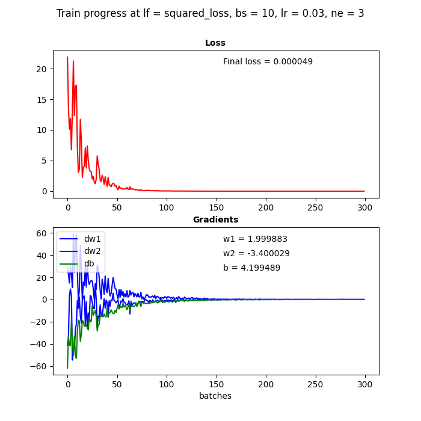
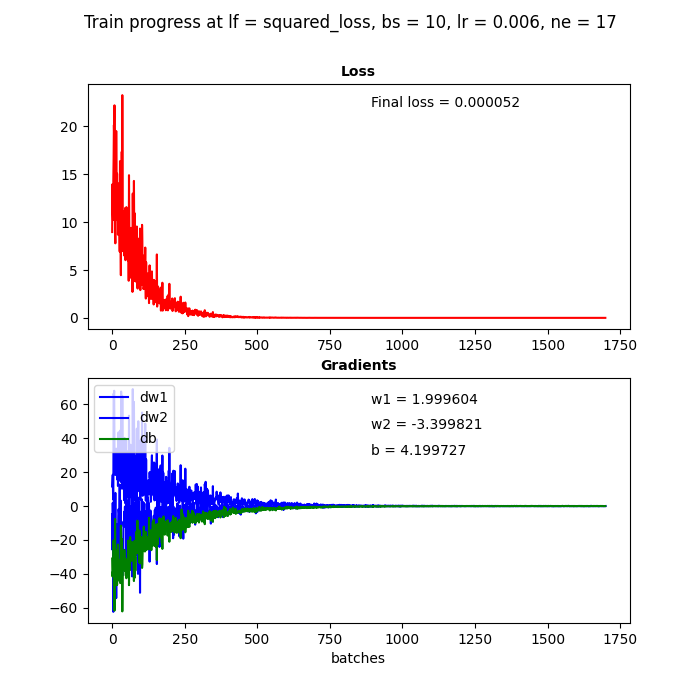
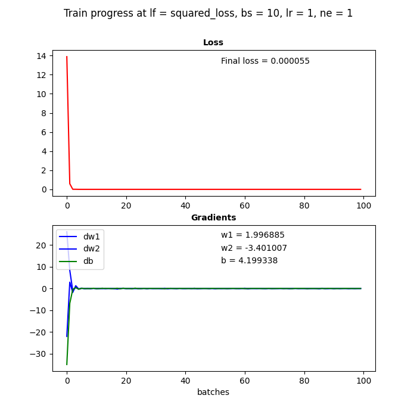
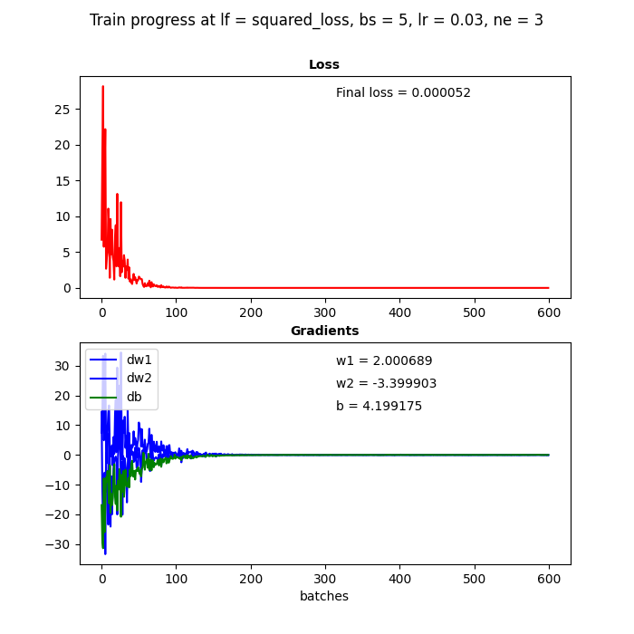
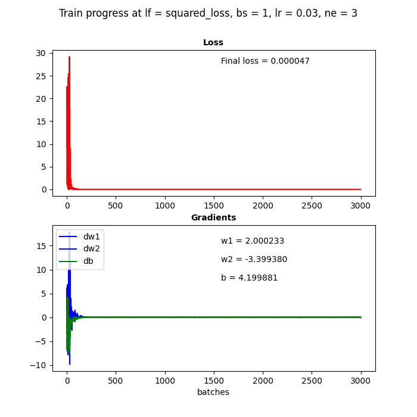
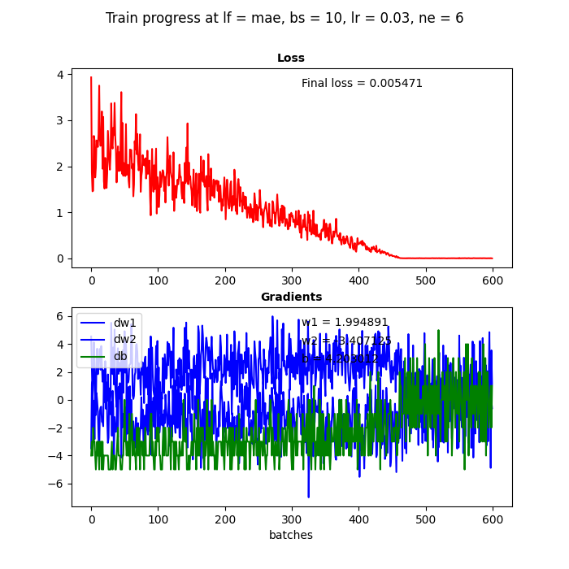

##  Linear regression study

In the file lin_regr.py you may find a code which using linear regression method seeks weights and bias of the function 
having format:  w1*x1 + w2*x2 +…+ wn*xn + b. 

In order to test our code and observe training process we have generated test data using function 2*x1-3,4*x2+4.2, so 
its weights (2, -3,4) and bias (4,2) we are going to predict.

Our models allows usage of two loss functions: minimal squared loss and, less popular, minimal absolute error (MAE). 
In the first case we square distances between estimated and real values, in the second we do not.

We also may change hyperparameters: batch size (bs), learning rate (lr) and number of epochs (ne) to regulate training 
speed and accuracy of the training.

Let’s start with batch size = 10, learning rate = 0.03 and 3 epochs and minimal squared loss as loss function. 
At the graphs below we see decrease in loss and gradients of weights (dw1, dw2 and db) as number of batches processed increases.
Final loss and estimated weights are indicated on the graphs as well. Looking at these parameters we may conclude about
 effectiveness of hyperparameters and loss function selected. Under hyperparameters chosen we have observed that 2 
 epochs (even one) are enough to find parameters with very good final loss – **49** E10^6.

 

Let’s increase number of epochs to 6, we observe little accuracy improvement - **47** E10^6 but make our model work longer.

  

Let’s decrease our learning rate by 5 times to 0.006. We see that training process become slower and to achieve
 acceptable loss level we need much more epochs. 

  

Then let’s try to increase the learning rate up to 1. We observe quick training, with the same good loss level. seems
 a pair of batches are enough.

   

Decreasing the batch size to 5 provides requires a half of epoch with loss comparable to result from 10 batches under
the same other hyperparameters.

We may even take one item batch and result is good. However, such method when used with other functions is risky as 
may get stuck at local minima.

If we try other cardinal point - batch size equal to test data size (1000), training will be very slow and even 40 
epochs are not enough to get acceptable final loss.

 
 
Let's see how the model work if we change loss function to MAE. Setting the same parameters it tooks 5 epochs to get minimal
loss - **5471** E10^6, but this loss is 100 times higher than squared error results. 

**Conclusion**

Hyperparameters impact the accuracy and the speed of the training process. Optimal hyperparameters are interrelated. 
Increasing learning rate we increase the speed of training (less epochs needed) but it may negatively impact accuracy 
(however we do not observe worsening when testing using our model). Decreasing learning rate we theoretically have 
more chances to hit our extrema, but more epochs needed. Decreasing batchsize leads to speed up of the training.
 
MAE loss function has demonstrated worse results than squared loss function for our function.     

Code for testing the model and drawing figures above may be found at **lin_regr.py**

Also refer to [GitHub page](https://github.com/denismoroz1981/ML29092020/tree/master/hw_6_moroz).

