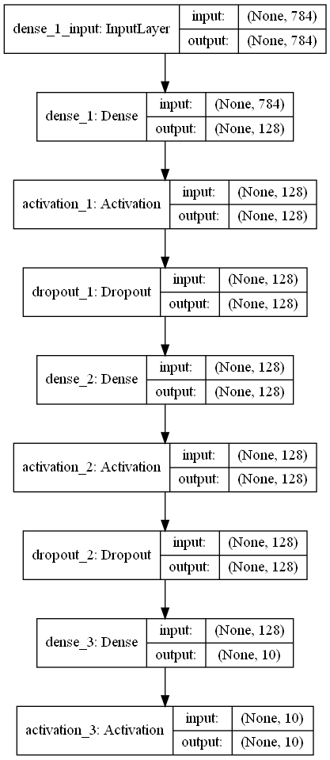

##  Perceptron_V

I studied files containing perceptron realization using *Keras* library.

**keras_MNIST_V1.py**

After setting hyperparameters which will be used for model training and validation, MNIST data is loaded: 

```
(X_train, y_train), (X_test, y_test) = mnist.load_data()
```     
Then for usage in the perceptron model MNIST data is preprocessed:
1) *vectorization*: MNIST pictures are stored in 28*28 matrices and for further processing should be vectorized, 
so we should have 784 item 1D vector for every picture.
2) *conversion to float type*
3) *normalization*: division by 255 to have all data in range [0,1].

Then label vectors are converted to binary class matrixes (so called one-hot encoding) as the labels in our case
have no ordering and no relation between values:
```
Y_train = np_utils.to_categorical(y_train, NB_CLASSES)
Y_test = np_utils.to_categorical(y_test, NB_CLASSES)
```
In other words we replace numeric label with a vector of categorical feature variables where this label value is one,
the rest labels are zeros, e.g., label "5" is replaced with a vector [0. 0. 0. 0. 0. 1. 0. 0. 0. 0.]. 

After data preprocessing stage we start construction a perceptron, first selecting a type of perceptron - sequential,
that means linear pipline of neuron layers.

In this example our perceptron has only two layers: input and output. Input one has 784 neurons and output one - 10.
In Keras input layer is not a real layer, so we add one Dence type layer, indicating the shape of the input object 
as an argument. 

```
model.add(Dense(NB_CLASSES, input_shape=(RESHAPED,)))
```
Output from the dence layers will be passed through "softmax" activation function.
```
model.add(Activation('softmax'))
```
To see composition of our model we may launch:
```
model.summary()
```

Now we compile our model specifyng loss function, optimizer and metric... 
```
model.compile(loss='categorical_crossentropy',
               optimizer=OPTIMIZER,
               metrics=['accuracy'])
```
... and train indicating hyperparameters such as batch size and number of epochs.
```
history = model.fit(X_train, Y_train,
                     batch_size=BATCH_SIZE,
                     epochs=NB_EPOCH,
                     verbose=VERBOSE,
                     validation_split=VALIDATION_SPLIT)
```
Parameter *"validation_split"* allows for splitting data between training and validation.

For label prediction method *"evaluate"*" is used.
```
score = model.evaluate(X_test, Y_test, verbose=VERBOSE) 
```
This method returns metrics: test score and test accuracy. The score is a mean loss and the accuracy is the share of
correctly predicted labels. The lower score the higher accuracy.

**keras_MNIST_V2.py**

This file is an extension of the perceptron from the first file with two hidden layers. As activation function for them
"relu" is used. 
```
model.add(Dense(N_HIDDEN, input_shape=(RESHAPED,)))
model.add(Activation('relu'))
model.add(Dense(N_HIDDEN))
model.add(Activation('relu'))
model.add(Dense(NB_CLASSES))
model.add(Activation('softmax'))
```

**keras_MNIST_V3.py**

To avoid overfitting dropout layers between dense layers are added. 

```
model.add(Dropout(DROPOUT)) 
```
Dropout means randomly "dropping out", or omitting, units (both hidden and visible) during the training 
process of a neural network. We set *rate* argument, being float between 0 and zero,
defining fraction of input units we want to drop at each step during training time.
Inputs not set to 0 are scaled up by 1/(1 - rate) such that the sum over all inputs is unchanged.

In this file you may also find visualization of training and testing process metrics (accuracy and loss) by epoch. It is 
importand for understanding whether our model is overfitted or underfitted.

**keras_MNIST_V4.py**

To store our model and share it, serialisation is used.

We may serialise model structure to json...
```
model_json = model.to_json()
with open("model.json", "w") as json_file:
    json_file.write(model_json)
```
... and weights obtained from traing into HDF5.
```
model.save_weights("model.h5")
```
Then the model and its weights might be deserialised.
```
json_file = open('model.json', 'r')
loaded_model_json = json_file.read()
json_file.close()
loaded_model = model_from_json(loaded_model_json)
loaded_model.load_weights("model.h5")
```
We may save model and architecture to a single file and then upload.
```
model.save("model_4.h5")
model = load_model('model_4.h5')
```
System saves graphical illustration of our model architecture as well.

